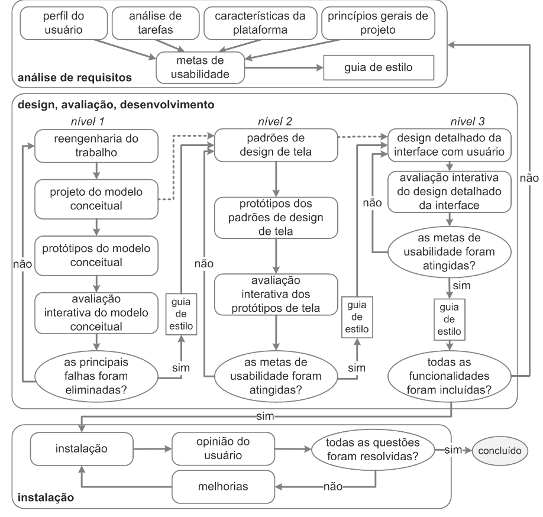

# Ciclo de Vida

## Introdução

A Engenharia de Usabilidade de Mayhew (Figura 1) agrupa e organiza várias atividades na área de Interação Humano-Computador, guiando o designer em uma direção interativa. Esse ciclo de vida permite, através de atividades bem detalhadas, compreender o perfil do usuário do site antes de avançar para a fase de design, sempre sustentada pela avaliação contínua, iterando por prototipagens em diferentes níveis. Assim, em todas as etapas do ciclo, a interação entre as fases do projeto se mantém constante.

## Motivo da Escolha

Para a escolha, o grupo discutiu as vantagens e desvantagens de cada modelo para chegar a um consenso sobre o melhor processo para o projeto. Concluímos que o Ciclo de Vida de Mayhew era o candidato mais adequado por várias razões, como o fato de suas etapas serem detalhadas e bem definidas, reduzindo a subjetividade em comparação com o ciclo de vida simples, por exemplo. Como o grupo não possui experiência na área de IHC, um modelo mais robusto e detalhado seria mais apropriado para nossa situação, servindo como um guia. Assim, o [cronograma](https://interacao-humano-computador.github.io/2024.1-DETRANDF/planejamento/cronograma/) foi elaborado com base nas atividades de análise de requisitos, design, avaliação e desenvolvimento. Dada a natureza do projeto, as atividades de instalação foram realizadas juntamente com a análise de requisitos, pois o produto já está finalizado.

### Ciclo de vida Mayhew

## Referências Bibliográficas

> BARBOSA, S. D. J.; SILVA, B. S. Interação Humano-Computador. Rio de Janeiro: Elsevier, 2011.

## Histórico de Versão

| Versão |    Data    |                Descrição                 |                    Autor(es)                     |                 Revisor(es)                  |
| ------ | ---------- | ------------------------------------------- | ------------------------------------------------ | ------------------------------------------- |
| `1.0`  | 08/07/2024 | Criação do documento | [Filipe Carvalho](https://github.com/filipe-002) |  |