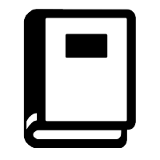
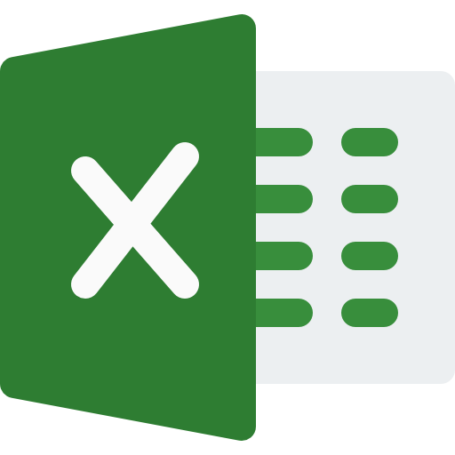

# Ferramentas

## Introdução

Cada ferramenta selecionada foi cuidadosamente integrada em nosso fluxo de trabalho para garantir uma abordagem profissional e coesa em todas as etapas do projeto. Desde a organização estratégica até a produção visual de alto padrão, estas ferramentas desempenham papéis cruciais no desenvolvimento do projeto.

&emsp;&emsp;

## Ferramentas Utilizadas

**Tabela 1** - Ferramentas Utilizadas no Projeto

|                                                                                                                                                                                                       | Ferramenta                | Finalidade                                                                                                  |
| :---------------------------------------------------------------------------------------------------------------------------------------------------------------------------------------------------: | ------------------------- | ----------------------------------------------------------------------------------------------------------- |
| {: style="height:100px;width:100px"} | GitHub                    | Organizar, versionar e documentar artefatos produzidos para o projeto.<a id="anchor_1" href="#FRM1">^1^</a> |
|                                                    {: style="height:100px;width:100px"}| Discord          | Realizações de reuniões e gravações de apresentações.<a id="anchor_2" href="#FRM2">^2^</a>                  |
|                                                          {: style="height:100px;width:100px"}                                                         | Figma                     | Produção de artefatos gráficos.<a id="anchor_3" href="#FRM3">^3^</a>                                        |
|                                                                          {: style="height:100px;width:100px"}                                                                          | MkDocs                    | Criação das páginas de documentação.<a id="anchor_4" href="#FRM4">^4^</a>                                   |
|                                                   {: style="height:85px;width:85px"}                                                   | Visual Studio Code        | Edição dos arquivos de documentação. <a id="anchor_5" href="#FRM5">^5^</a>                                  |
|                                                       {: style="height:85px;width:85px"}                                                       | WhatsApp                  | Utilizado como principal canal de comunicação. <a id="anchor_6" href="#FRM6">^6^</a>                        |
|                                                        {: style="height:100px;width:100px"}                                                        | YouTube                   | Hospedagem de vídeos produzidos. <a id="anchor_7" href="#FRM7">^7^</a>                                      |
|                                                   {: style="height:94px;width:72px"}                                                    | Excel          | Criação de planilhas relacionadas ao cronograma e horários. <a id="anchor_8" href="#FRM8">^8^</a>           |

_Fonte: Autores._

## Bibliografia

> <a id="FRM1" href="#anchor_1">1.</a> GitHub. Disponível em: [https://docs.github.com/pt](). Acesso em: 04 de abr. de 2024.
>
> <a id="FRM2" href="#anchor_2">2.</a> Discord. Disponível em: [https://discord.com/](). Acesso em: 04 de abr. de 2024.
>
> <a id="FRM3" href="#anchor_3">3.</a> Figma. Disponível em: [https://www.figma.com/](). Acesso em: 04 de abr. de 2024.
>
> <a id="FRM4" href="#anchor_4">4.</a> MkDocs. Disponível em: [https://www.mkdocs.org/](). Acesso em: 04 de abr. de 2024.
>
> <a id="FRM5" href="#anchor_5">5.</a> Visual Studio Code. Disponível em: [https://code.visualstudio.com/](). Acesso em: 04 de abr. de 2024.
>
> <a id="FRM6" href="#anchor_6">6.</a> WhatsApp. Disponível em: [https://www.whatsapp.com/?lang=pt_br](). Acesso em: 04 de abr. de 2024.
>
> <a id="FRM7" href="#anchor_7">7.</a> YouTube. Disponível em: [https://about.youtube/](). Acesso em: 04 de abr. de 2024.
>
> <a id="FRM8" href="#anchor_8">8.</a> Excel. Disponível em: [https://www.google.com/intl/pt-BR/sheets/about/](). Acesso em: 04 de abr. de 2024.
>
## Histórico de Versões

| Versão | Data       | Descrição                                 | Autor(es)                                                                                         | Revisor(es)                                    |
| ------ | ---------- | ----------------------------------------- | ------------------------------------------------------------------------------------------------- | ---------------------------------------------- |
| `1.0`  | 04/04/2024 | Criação da página de ferramentas.         | [Filipe Carvalho](https://github.com/Filipe-002)| [Vinicius Vieira](https://github.com/viniciusvieira00) |