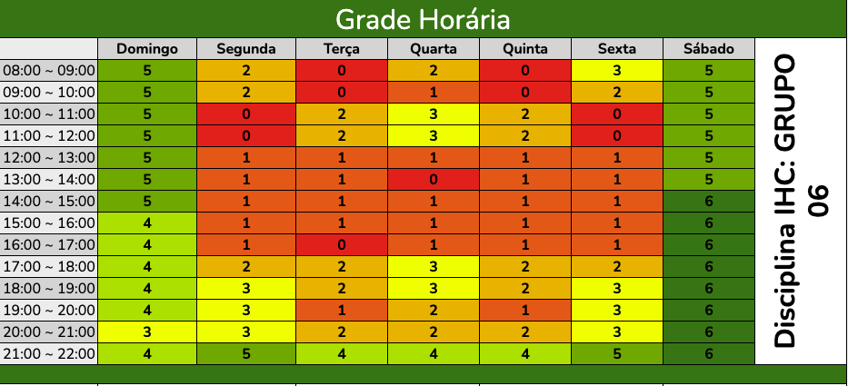
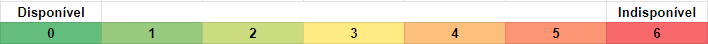

# Heatmap

## <a>Heatmap de quadro de indisponibilidade</a>
Neste documento está apresentado o quadro de disponibilidade dos integrantes do grupo. Os membros preencheram tabelas individuais indicando seus dias disponíveis (veja mais). Este processo permite a identificação dos períodos nos quais há maior disponibilidade coletiva, facilitando reunir o grupo em atividades que exigem a participação do maior número possível de integrantes. A figura 1 abaixo ilustra o quadro de disponibilidade, fornecendo uma visualização clara das informações.  

*Figura 1 - Mapa de calor (Figura do autor, 2024)*
  

Na figura 2 abaixo, a legenda esclarece que números superiores a zero indicam a quantidade de integrantes que não estão disponíveis em determinados horários. Isso nos permite interpretar a tabela anterior, fornecendo insights sobre quantos membros podem não comparecer às reuniões em diferentes momentos do dia.  

*Figura 2 - Legenda Heatmap  (Figura do autor, 2024)*

## <a>Bibliografia</a>
- HEATMAP. Disponível em: https://neilpatel.com/br/blog/heatmap-o-que-e Acesso em: 20 de março de 2024.

## <a>Histórico de Versão</a>
|Data|Data Prevista de Revisão|Versão|Descrição|Autor|Revisor|
| :----------: |:-----------:| :------: | :-----------: | :---------: |:---------: |
|24/03/2024|24/03/2024|1.0|Criação do Documento|[Vinicius Vieira](https://github.com/viniciusvieira00)| Pedro Sena |