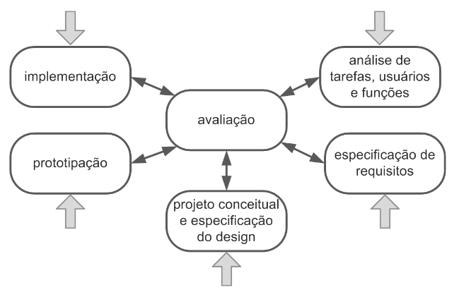

# Processo de Design

## Introdução

Nesta seção, explicaremos quais processos de design levamos em consideração, qual escolhemos e por quê. Contudo, primeiramente, é necessário esclarecer o que é design.

Design é o processo de analisar a situação atual, executar uma intervenção planejada e avaliar os efeitos dessa intervenção. Ou seja, no que tange a engenharia de software, design significa entender o estado atual de um software e como os usuários o utilizam ou utilizariam, aplicar mudanças para alcançar um estado mais desejado e verificar os resultados condizem com as expectativas. 

## Ciclo de vida simples
O ciclo de vida simples se baseia na ideia de um ciclo de atividades até a entrega do produto.
Primeiro, identifica-se as necessidades e define-se os requisitos, é feito o design, construção de versão interativa a avaliação. 
Sendo que a qualquer ponto do ciclo pode-se definir mais requisitos ou refazer o design.

_Ciclo de vida simples. (Fonte: Interação Humano Computador - BARBOSA, Simone; DINIZ, Bruno. 2010)_

O ciclo de vida simples tem como principal sua característica sua simplicidade, que o torna fácil de executar. Porém, sua falta de detalhes o torna uma opção não tão boa para projetos mais complexos ou para engenheiros de software menos experientes.

## Ciclo de vida em estrela
O ciclo de vida em estrela é mais detalhado que o ciclo de vida simples, separando uma etapa em duas e acrescentando outras, como por exemplo: análise de tarefas, usuários e funções.
Nele, o designer escolhe em qual etapa começar, mas a avaliação precisa ser realizada depois das outras atividades. (BARBOSA e SILVA, 2011, p.104)

_Ciclo de vida em estrela (Fonte: Interação Humano Computador - BARBOSA, Simone; DINIZ, Bruno. 2010)_

## Engenharia de Usabilidade de Nielsen
Engenharia de usabilidade para Nielsen é um conjunto atividades que devem ocorrer em todo ciclo de vida do produto, sendo elas (BARBOSA e SILVA, 2011, p.104):
 

<b>Tabela 01</b> - Conjunto de atividades 

  <table>
    <tr>
      <td><strong>Conheça seu usuário</strong></td>
      <td><strong>Realize uma análise competitiva</strong></td>
    </tr>
    <tr>
      <td><strong>Defina as metas de usabilidade</strong></td>
      <td><strong>Faça designs paralelos</strong></td>
    </tr>
    <tr>
      <td><strong>Adote o design participativo</strong></td>
      <td><strong>Faça o design coordenado da interface como um todo</strong></td>
    </tr>
    <tr>
      <td><strong>Aplique diretrizes e análise heurística</strong></td>
      <td><strong>Faça protótipos</strong></td>
    </tr>
    <tr>
      <td><strong>Realize testes empíricos</strong></td>
      <td><strong>Pratique design iterativo</strong></td>
    </tr>
  </table>

## Engenharia de Usabilidade de Mayhew
Com uma visão holística, esse processo de design reúne e organiza diferentes ativida-
des propostas na área de IHC para orientar o trabalho do designer em direção a uma
boa solução interativa.
Esta proposta de Mayhew traz um modelo muito mais detalhado que as anteriores, e é dividida em três principais etapas: análise de requisitos, design/avaliação/desenvolvimento e instalação. (BARBOSA e SILVA, 2011, p.104)

_Engenharia de Usabilidade de Mayhew (Fonte: Interação Humano Computador - BARBOSA, Simone; DINIZ, Bruno. 2010)_

## Escolha da equipe

O grupo 6 optou pela Engenharia de Usabilidade de Mayhew como processo de design porque ela é mais detalhada e robusta e, portanto, mais indicada para designers menos experientes, que é o caso da equipe em questão.

## Bibliografia
- BARBOSA, S. D. J; SILVA, B. S., Interação Humano-Computador, 1a. Edição, Editora Campus, 2010
- [Slides](https://docente.ifrn.edu.br/joaoqueiroz/disciplinas/ihc-interacao-humano-computador/aulas/aula-5)

## Histórico de Versões

| Versão | Data       | Descrição                                 | Autor(es)                                                                                         | Revisor(es)                                    |
| ------ | ---------- | ----------------------------------------- | ------------------------------------------------------------------------------------------------- | ---------------------------------------------- |
| `1.0`  | 04/04/2024 | Criação da página.         | [Pedro Sena](https://github.com/pedroyen21)| [Filipe Carvalho](https://github.com/Filipe-002) |
